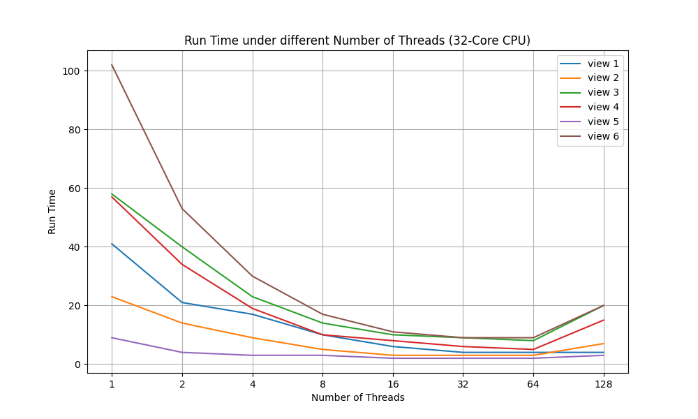
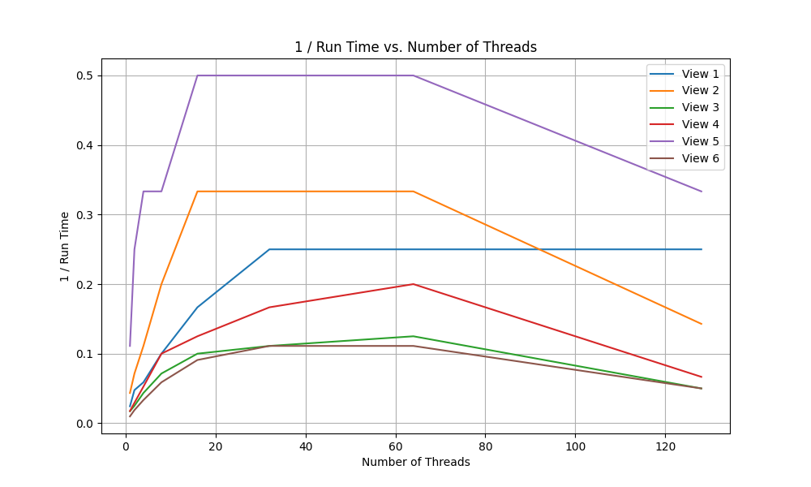

# Report

CPU:
13th Gen Intel(R) Core(TM) i9-13900HX 2.20 GHz 32 Cores

## Asst 1 Prob 1

### My Approach

Divide the image to almost same number of rows for each thread.

### Experiments

Time of different #threads, from view 1 to 6 top down:

| 1   | 2  | 4  | 8  | 16 | 32 | 64 | 128 |
|-----|----|----|----|----|----|----|-----|
| 41  | 21 | 17 | 10 | 6  | 4  | 4  | 4   |
| 23  | 14 | 9  | 5  | 3  | 3  | 3  | 7   |
| 58  | 40 | 23 | 14 | 10 | 9  | 8  | 20  |
| 57  | 34 | 19 | 10 | 8  | 6  | 5  | 15  |
| 9   | 4  | 3  | 3  | 2  | 2  | 2  | 3   |
| 102 | 53 | 30 | 17 | 11 | 9  | 9  | 20  |

### Observation & Hypothesis

My Observation:

1. The faster the serial version, the smaller speed-up of the parallel version
2. As the #threads goes up, the speed-up slows down. More importantly, when the #threads reaches and outnumbers the #cores of the CPU, no more speed-up or even slower.

My Hypothesis:

- Creating threads needs time.
- Switching between threads also needs time. That's why there is no more speed-up or even slow-down as #threads outnumbers the #cores of the CPU.
- Each thread does some extra work than serial version.

### Validation