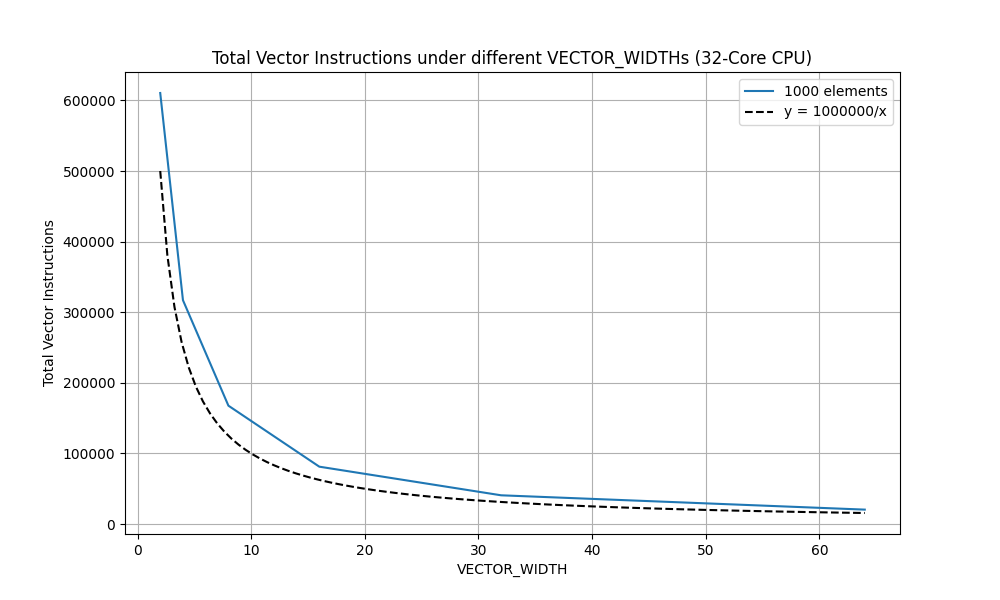

# Report

CPU:
13th Gen Intel(R) Core(TM) i9-13900HX 2.20 GHz 32 Cores

## Asst 1 Prob 2

### My Approach

#### clampedExpVector

Key points:

- Use mask vector to decide operations for each element.
- Use `maskNumber` to indicate the "valid" positions in an vector, because the condition `N % VECTOR_WIDTH == 0` may not holds.
- Use `maskIsOdd`, `maskIsPositive` etc. to imitate the `while`, `if` statements.
- Set corresponding `y` to 0 then compute the `y > 0` condition to imitate the `break` statement. 

#### arraySumVector

Two stages:

1. Based on the hypothesis that "Assume N % VECTOR_WIDTH == 0", divide the array into vector blocks, then simply add all following blocks to the first block. Time complexity is $O(N/W)$
2. Based on the hypothesis that "Assume VECTOR_WIDTH is a power of 2", reduce the length of vector by half for each step, by adding two "cooresponding" element, in $O(\log_2{W})$ steps. This method can be implemented through using `_cmu418_interleave_float` then `_cmu418_hadd_float`. We just need get the first element in the end. Time complexity is $O(\log_2{W})$.

So the implementation have at most O(N/W + log2 W ) span.


### Experiments

```bash
./vrun -s 10000
```

The data in the first row are total vector instructions, in the second row are vector utilizations, under different VECTOR_WIDTH.

| 2          | 4          | 8          | 16         | 32         | 64         |
|------------|------------|------------|------------|------------|------------|
| 610480     | 317039     | 167634     | 81231      | 40693      | 20413      |
| 72.778060% | 71.761439% | 71.255042% | 71.124555% | 71.064055% | 70.957463% |



### Observation & Hypothesis

My Observation:

- The curve of total vector instructions changed with VECTOR_WIDTH looks very close to the function $f(x) = \frac{1000000}{x}$.
- The vector utilizations slight goes down as the VECTOR_WIDTH increases.


My Hypothesis:

- The number of instructions, which is a measurement of time, matches the time complexity $O(N/W)$, as the $W$ varys. 
- The larger the $W$, the more likely more positions are "wasted" at the end beacuse of the condition `N % VECTOR_WIDTH == 0` does not always hold.
